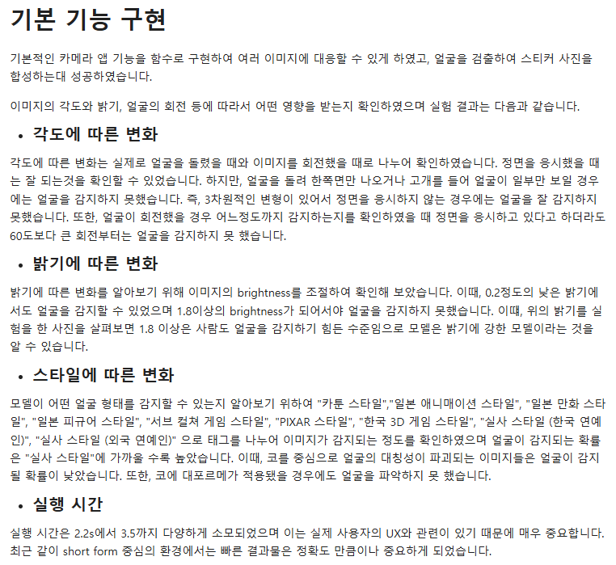
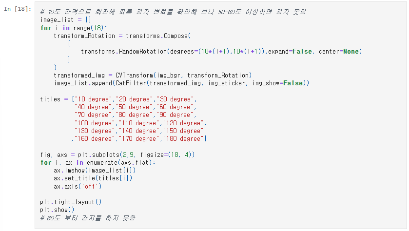
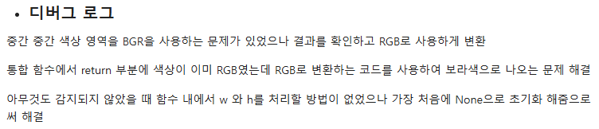
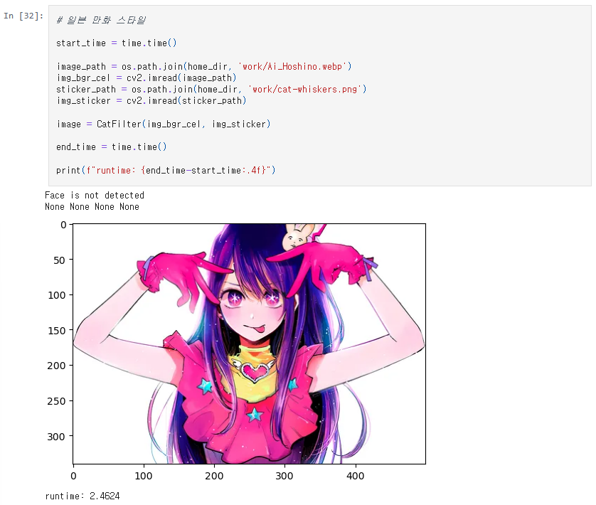
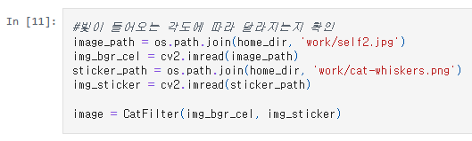
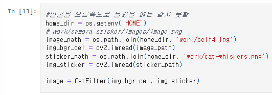
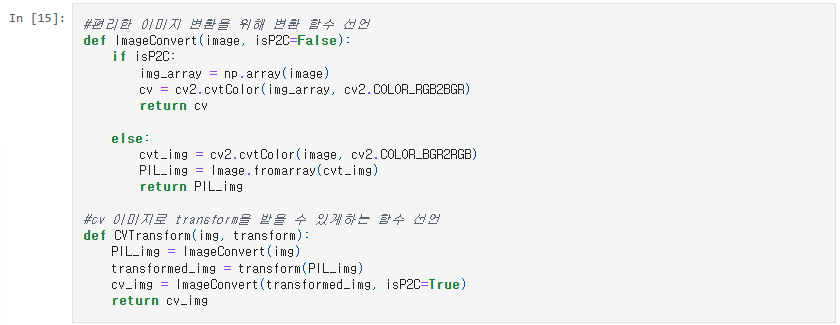

# AIFFEL Campus Online Code Peer Review Templete

- 코더 : 구재현
- 리뷰어 : 이지연

# PRT(Peer Review Template)

- [x] **1. 주어진 문제를 해결하는 완성된 코드가 제출되었나요?**

  - 문제에서 요구하는 최종 결과물이 첨부되었는지 확인 - 중요! 해당 조건을 만족하는 부분을 캡쳐해 근거로 첨부
    

  결과에 대한 내용을 각도, 밝기, 스타일로 구분하여 보고서 형식으로 깔끔하게 정리하였다.

- [x] **2. 전체 코드에서 가장 핵심적이거나 가장 복잡하고 이해하기 어려운 부분에 작성된
      주석 또는 doc string을 보고 해당 코드가 잘 이해되었나요?** - 해당 코드 블럭을 왜 핵심적이라고 생각하는지 확인 - 해당 코드 블럭에 doc string/annotation이 달려 있는지 확인 - 해당 코드의 기능, 존재 이유, 작동 원리 등을 기술했는지 확인 - 주석을 보고 코드 이해가 잘 되었는지 확인 - 중요! 잘 작성되었다고 생각되는 부분을 캡쳐해 근거로 첨부
      

      이미지 회전을 통해 얼굴 인식 가능한 각도를 수치화 하고자 하였다. 이 외에도 이미지 밝기도 변화시키면서 얼굴 인식이 가능한 임계값을 찾고자 노력하였다.

- [x] **3. 에러가 난 부분을 디버깅하여 문제를 해결한 기록을 남겼거나
      새로운 시도 또는 추가 실험을 수행해봤나요?** - 문제 원인 및 해결 과정을 잘 기록하였는지 확인 - 프로젝트 평가 기준에 더해 추가적으로 수행한 나만의 시도,
      실험이 기록되어 있는지 확인 - 중요! 잘 작성되었다고 생각되는 부분을 캡쳐해 근거로 첨부
      

      디버깅 로그를 작성하여 이미지 변환이나 얼굴 인식 과정에서 발생하는 문제를 해결한 기록을 남겼다.

      

      일본 만화 스타일 외에도 다양한 이미지를 활용하여 범용성을 확인하고자 시도하였다.

- [x] **4. 회고를 잘 작성했나요?**

  - 주어진 문제를 해결하는 완성된 코드 내지 프로젝트 결과물에 대해
    배운점과 아쉬운점, 느낀점 등이 기록되어 있는지 확인
  - 전체 코드 실행 플로우를 그래프로 그려서 이해를 돕고 있는지 확인
    - 중요! 잘 작성되었다고 생각되는 부분을 캡쳐해 근거로 첨부

  

  

  다양한 시도를 진행하였고 해당 결과를 각 셀마다 기록하면서 정리하였다.

- [x] **5. 코드가 간결하고 효율적인가요?**

  - 파이썬 스타일 가이드 (PEP8) 를 준수하였는지 확인
  - 코드 중복을 최소화하고 범용적으로 사용할 수 있도록 함수화/모듈화했는지 확인 - 중요! 잘 작성되었다고 생각되는 부분을 캡쳐해 근거로 첨부
    

  이미지 변환을 위한 함수를 구현하여 중복을 최소화 하였다.

# 회고(참고 링크 및 코드 개선)

```
# 굉장히 다양한 시도를 진행하였고 그 기록을 전부 남겨둬서 굉장히 유용한 정보를 얻을 수 있었다. 특히, 이미지 스타일에 대한 내용은 생각해 보지 않았는데 굉장히 다양하게 범용성을 높이기 위한 고려 사항을 많이 고민한 흔적이 보여서 좋았다.
```
