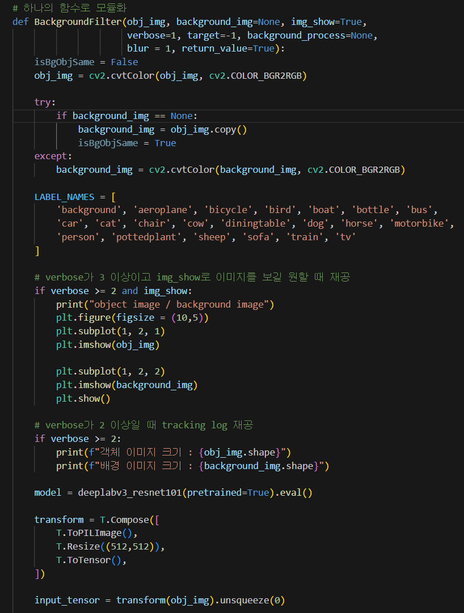
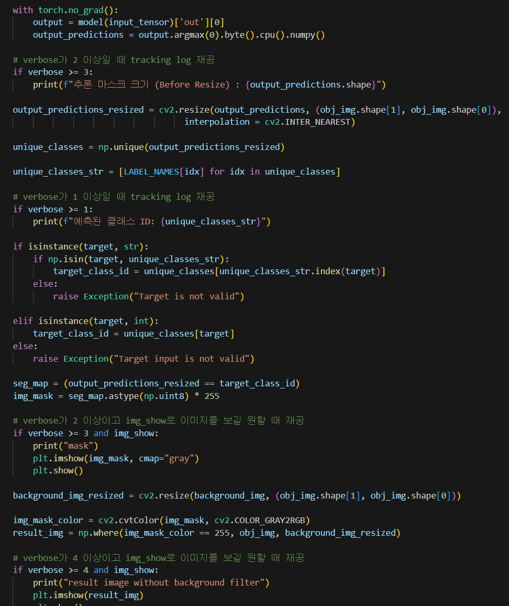
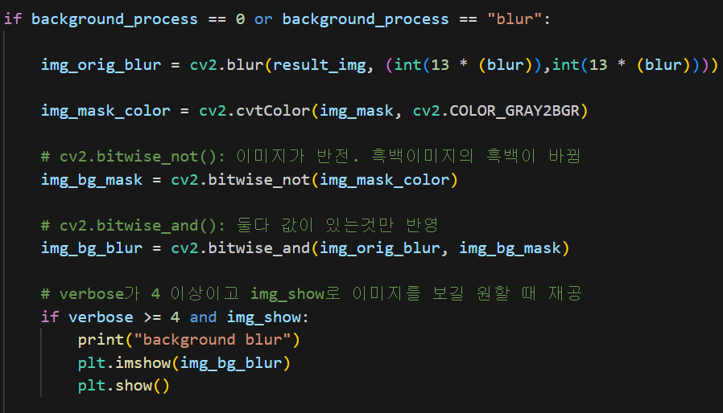
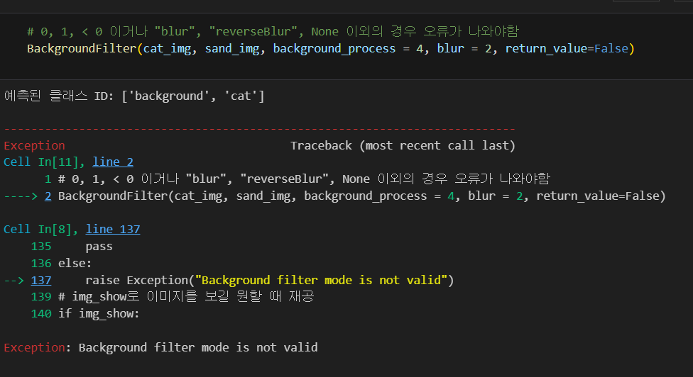
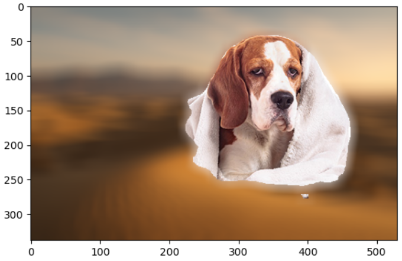
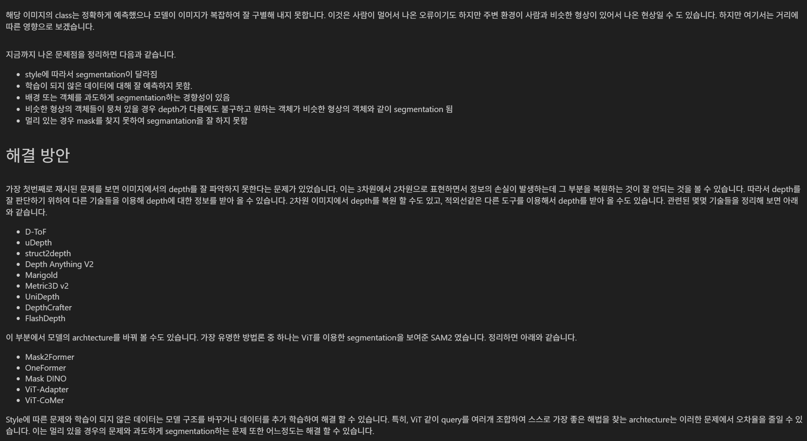
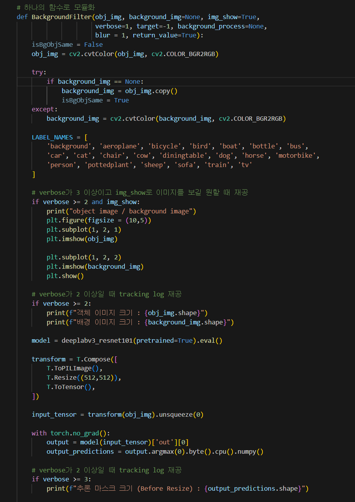
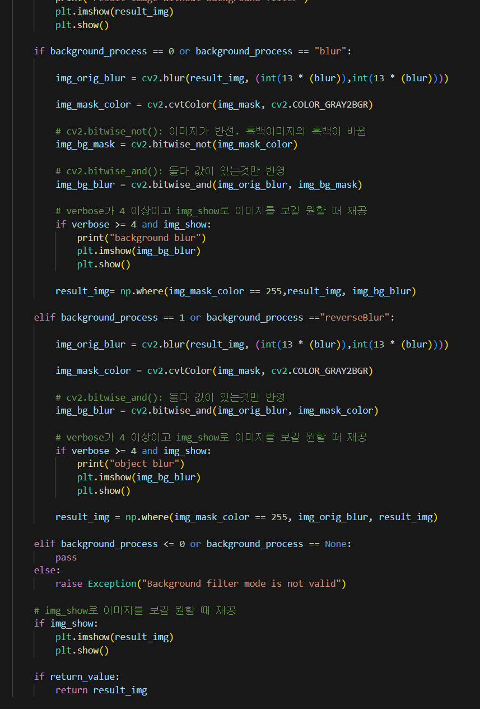

# AIFFEL Campus Online Code Peer Review Templete
- 코더 : 구재현
- 리뷰어 : 최원진


# PRT(Peer Review Template)
- [O]  **1. 주어진 문제를 해결하는 완성된 코드가 제출되었나요?**
    - 문제에서 요구하는 최종 결과물이 첨부되었는지 확인
        - 중요! 해당 조건을 만족하는 부분을 캡쳐해 근거로 첨부
    
    문제의 전 과정을 하나의 모듈로 정리하여 코드를 완성했습니다.
    
    


- [O]  **2. 전체 코드에서 가장 핵심적이거나 가장 복잡하고 이해하기 어려운 부분에 작성된 
주석 또는 doc string을 보고 해당 코드가 잘 이해되었나요?**
    - 해당 코드 블럭을 왜 핵심적이라고 생각하는지 확인
    - 해당 코드 블럭에 doc string/annotation이 달려 있는지 확인
    - 해당 코드의 기능, 존재 이유, 작동 원리 등을 기술했는지 확인
    - 주석을 보고 코드 이해가 잘 되었는지 확인
        - 중요! 잘 작성되었다고 생각되는 부분을 캡쳐해 근거로 첨부

    각 함수의 사용 이유와 의미를 주석으로 이해하기 쉽게 설명해주셨고,
    각 파라미터의 역할도 주석으로 남겨주셨습니다.
    
    
        
- [O]  **3. 에러가 난 부분을 디버깅하여 문제를 해결한 기록을 남겼거나
새로운 시도 또는 추가 실험을 수행해봤나요?**
    - 문제 원인 및 해결 과정을 잘 기록하였는지 확인
    - 프로젝트 평가 기준에 더해 추가적으로 수행한 나만의 시도, 
    실험이 기록되어 있는지 확인
        - 중요! 잘 작성되었다고 생각되는 부분을 캡쳐해 근거로 첨부

    구현한 모듈을 바탕으로 잘못된 파라미터 입력에 대한 오류를 예상했고,
    예상대로 오류가 발생하여 원인을 잘 파악하셨습니다.
    

    또한, 다양한 이미지들로 시도해보며 여러 결과물을 만들어냈습니다.
    
    
        
        
- [O]  **4. 회고를 잘 작성했나요?**
    - 주어진 문제를 해결하는 완성된 코드 내지 프로젝트 결과물에 대해
    배운점과 아쉬운점, 느낀점 등이 기록되어 있는지 확인
    - 전체 코드 실행 플로우를 그래프로 그려서 이해를 돕고 있는지 확인
        - 중요! 잘 작성되었다고 생각되는 부분을 캡쳐해 근거로 첨부

    이번 과제에서 사용했던 함수의 문제점을 설명해주셨고,
    과제의 마지막 단계인 솔루션 제공을 해주셨습니다.
    

        
- [O]  **5. 코드가 간결하고 효율적인가요?**
    - 파이썬 스타일 가이드 (PEP8) 를 준수하였는지 확인
    - 코드 중복을 최소화하고 범용적으로 사용할 수 있도록 함수화/모듈화했는지 확인
        - 중요! 잘 작성되었다고 생각되는 부분을 캡쳐해 근거로 첨부

    과제 수행을 위한 과정을 하나의 모듈로 압축해서 코드의 효율성을 높였고,
    여러 파라미터를 설정할 수 있어 자유도 또한 높았습니다.
    
    


# 회고(참고 링크 및 코드 개선)
```

가독성, 효율성을 모두 챙긴 코드와 
여러 시도를 해보며 목적에 맞는 결과물을 도출한 과제였습니다.
배울 점이 많았습니다.
감사합니다.

```
