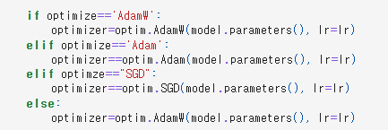

# AIFFEL Campus Online Code Peer Review Templete
- 코더 : 구재현
- 리뷰어 : 이수호


# PRT(Peer Review Template)
- [X]  **1. 주어진 문제를 해결하는 완성된 코드가 제출되었나요?**
    - 문제에서 요구하는 최종 결과물이 첨부되었는지 확인
        - 중요! 해당 조건을 만족하는 부분을 캡쳐해 근거로 첨부
        - 예측 요약을 한 결과를 출력하였다.
        
    
- [X]  **2. 전체 코드에서 가장 핵심적이거나 가장 복잡하고 이해하기 어려운 부분에 작성된 
주석 또는 doc string을 보고 해당 코드가 잘 이해되었나요?**
    - 해당 코드 블럭을 왜 핵심적이라고 생각하는지 확인
    - 해당 코드 블럭에 doc string/annotation이 달려 있는지 확인
    - 해당 코드의 기능, 존재 이유, 작동 원리 등을 기술했는지 확인
    - 주석을 보고 코드 이해가 잘 되었는지 확인
        - 중요! 잘 작성되었다고 생각되는 부분을 캡쳐해 근거로 첨부
        - 코드 한줄한줄 어떡 역할을 하는지 주석으로 달았다.
        
        
- [X]  **3. 에러가 난 부분을 디버깅하여 문제를 해결한 기록을 남겼거나
새로운 시도 또는 추가 실험을 수행해봤나요?**
    - 문제 원인 및 해결 과정을 잘 기록하였는지 확인
    - 프로젝트 평가 기준에 더해 추가적으로 수행한 나만의 시도, 
    실험이 기록되어 있는지 확인
        - 중요! 잘 작성되었다고 생각되는 부분을 캡쳐해 근거로 첨부
        - loss function을 여러개를 사용해서 성능 비교를 시도하였다.
        
        
- [X]  **4. 회고를 잘 작성했나요?**
    - 주어진 문제를 해결하는 완성된 코드 내지 프로젝트 결과물에 대해
    배운점과 아쉬운점, 느낀점 등이 기록되어 있는지 확인
    - 전체 코드 실행 플로우를 그래프로 그려서 이해를 돕고 있는지 확인
        - 중요! 잘 작성되었다고 생각되는 부분을 캡쳐해 근거로 첨부
        - 결과에 대해 느낀점을 자세하게 적어주었고, 표 형태로 결과를 비교하였다.
        
        
- [X]  **5. 코드가 간결하고 효율적인가요?**
    - 파이썬 스타일 가이드 (PEP8) 를 준수하였는지 확인
    - 코드 중복을 최소화하고 범용적으로 사용할 수 있도록 함수화/모듈화했는지 확인
        - 중요! 잘 작성되었다고 생각되는 부분을 캡쳐해 근거로 첨부
        - 함수 모듈화를 진행함으로써, 각 기능별로 한눈에 볼 수 있도록 작성하였다.
        
        


# 회고(참고 링크 및 코드 개선)
```
모듈화에 굉장히 신경을 많이 쓰신 것 같다. 함수로 전부 나눠 놓으니 전체 코드에 사용할 여러 기능들을 한눈에 확인할 수 있어서 편한 것 같다.  
max_len 설정을 preprocessing 하기 전으로 해놓으셔서 이 부분에 대해 간단하게 말씀드렸다.  
summarize 함수에 대해서도 preprocessing을 진행한 데이터를 input으로 넣는 게 아닌, 데이터를 다시 불러와서 원본 데이터를 넣어야 한다고 말씀드렸다.

# 리뷰어의 회고를 작성합니다.
# 코드 리뷰 시 참고한 링크가 있다면 링크와 간략한 설명을 첨부합니다.
# 코드 리뷰를 통해 개선한 코드가 있다면 코드와 간략한 설명을 첨부합니다.
```
