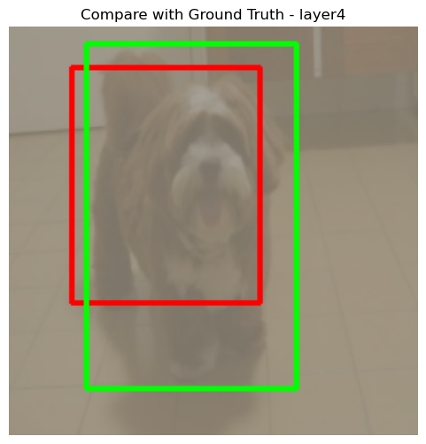
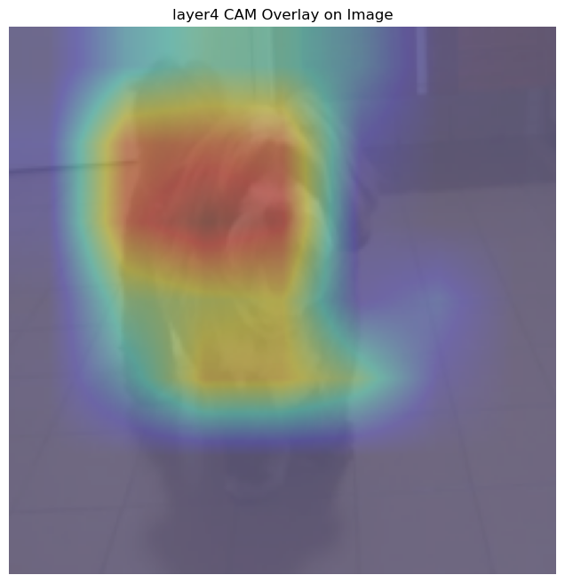
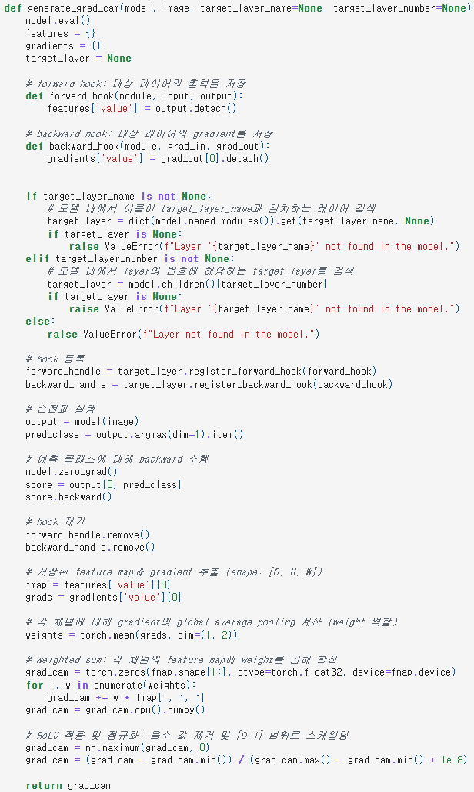
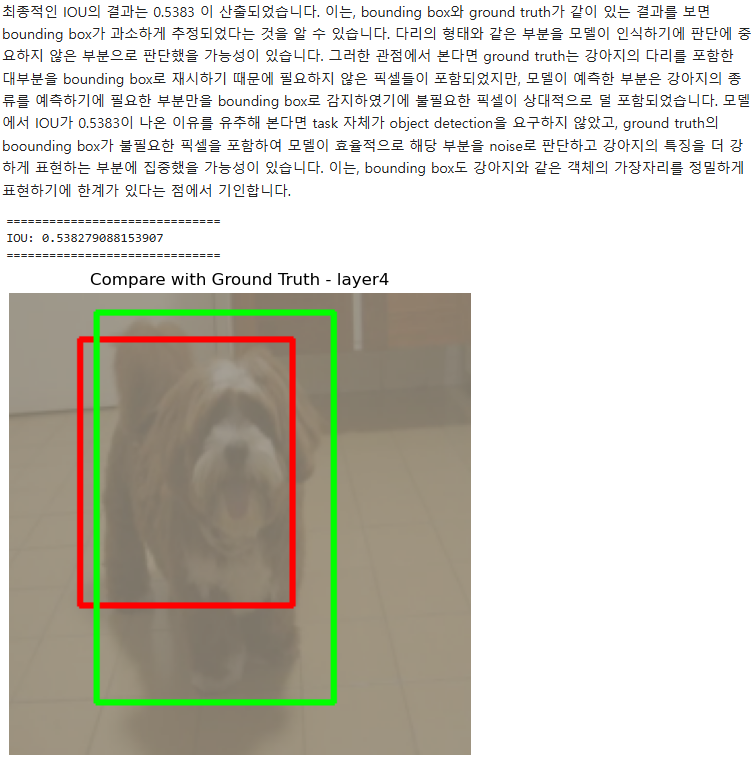

# AIFFEL Campus Online Code Peer Review Templete
- 코더 : 구재현
- 리뷰어 : 최재훈


# PRT(Peer Review Template)
- [x]  **1. 주어진 문제를 해결하는 완성된 코드가 제출되었나요?**
    - 훈련을 진행하며 그래프를 통해서 training, validation의 Loss, Acc의 값을 시각적으로 표현하여 학습의 진행 결과를 보기 쉽게 확인할 수 있었다.
    - 추가로 layer1,2,3,4 마다 시각적이미지를 추가해 layer가 변할수록 어디가 강조되는지도 확인할 수 있었다.
    
     | 
    
- [x]  **2. 전체 코드에서 가장 핵심적이거나 가장 복잡하고 이해하기 어려운 부분에 작성된 주석 또는 doc string을 보고 해당 코드가 잘 이해되었나요?**
    - 이번 퀘스트에서는 Grad-CAM에 대해 구현하고 시각적으로 확인하는 것이 중요하다고 생각된다.
    해당 코드에서는 모델의 특정 레이어가 이미지의 어느 부분을 보고 판단했는지 시각화하고 바운딩 박스를 추론하여 정답과 비교하는 부분이 잘 들어있다.

    
        
- [x]  **3. 에러가 난 부분을 디버깅하여 문제를 해결한 기록을 남겼거나 새로운 시도 또는 추가 실험을 수행해봤나요?**
    - 데이터 증강 기법을 사용해서 성능을 높인 것이 인상깊었다.

        

- [x]  **4. 회고를 잘 작성했나요?**
    - 기본이미지부터 레이어 하나하나 변해가면서 이미지를 보여주며 차이를 비교하였고 최종적인 IoU도 산출하여 잘 결론지었다. 마지막 바운딩 박스도 보여주며 최종 결과를 잘 제시하였다.

    
        
- [x]  **5. 코드가 간결하고 효율적인가요?**
    - 전체적으로 초반에 모듈화를 진행하여 겹치는 부분을 최소화하였고 학습을 진행할때 필요한 모듈을 가져와 사용하였다.


# 회고(참고 링크 및 코드 개선)
```
제가 실험 할때는 성능이 잘 안나와서 모델의 구조가 잘못된건지 고민했는데 데이터 증강을 사용한 것을 보고 저도 해봐야겠다는 생각을 했습니다. 그리고 레이어별로 시각화를 해서 보여준것도 좋았습니다.
초반 모듈화가 너무 깔끔하게 잘 되어있어서 코드 보는데 편했습니다.
```
